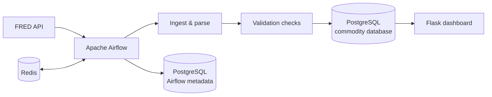

# FRED Commodity Data Pipeline

An end-to-end data engineering project that ingests commodity market data from the [Federal Reserve Economic Data (FRED)](https://fred.stlouisfed.org/) API, validates and stores it in PostgreSQL, and presents the results in a Flask dashboard.

The project is designed as a small, containerised data platform. Users can input hypothetical trade data via the Flask app and see hypothetical mark-to-market valuations and realised returns. It is worth noting the price streams included in the app are just commodity indices and are not a realistic reflection of actual tradeable contracts.

The container can be run locally – I have also hosted a live demo of the dashboard on an AWS EC2 instance, accessible at: <http://16.192.39.195:5001>. The public demo supports viewing only; trade submission is restricted. Please note that uptime and performance are not guaranteed.

## What it demonstrates

- Database construction using PostgreSQL
  - PostgreSQL stores both orchestration and application data.
- Apache Airflow orchestration
  - Tasks are scheduled and processed in parallel using dynamic task mapping.
- Per-series task isolation
  - Each Airflow task processes one FRED series, so a failure in one series retries independently without blocking or re-running the others.
- Incremental API ingestion
  - Data is ingested from a watermark set by the latest stored observation. The full history is ingested on the first run.
- Data-quality checks
  - Missing recent values, large price movements and stale series flag as soft warnings in task logs.
- Idempotent PostgreSQL upserts
  - Upserts are processed via primary keys and `ON CONFLICT`.
- Flask dashboard
  - Dashboard to visualise price history, summary metrics, trade entry, open positions, realised/unrealised P&L.
- Reproducible Docker Compose environment
  - All services are containerised via Docker Compose
- AWS deployment
  - The version deployed to EC2 uses the LocalExecutor configuration in `docker-compose.aws.yaml`. The AWS deployment uses LocalExecutor to reduce resource
    overhead on a small EC2 instance.

## Architecture



- NB: This reflects the local configuration; the version deployed on AWS does not use Redis.

## Instructions to run locally

### Prerequisites

- Docker Desktop (or Docker Engine with the Compose plugin)
- A free [FRED API key](https://fred.stlouisfed.org/docs/api/api_key.html)
- A fernet key - see the section below

### 1. Configure environment variables

Copy the example file:

```bash
cp .env.example .env
```

Edit `.env` and set `POSTGRES_PASSWORD` and your FRED key as `API_KEY`. Generate `FERNET_KEY` with:

```bash
pip install cryptography
python3 -c "from cryptography.fernet import Fernet; print(Fernet.generate_key().decode())"
```

### 2. Start the container

From the repository root, run the standard local Compose file:

```bash
docker compose up --build -d
```

### 3. Open Airflow UI to check DAG runs

Open [http://localhost:8080](http://localhost:8080) and sign in.

There are two DAGs – `db_bootstrap` and `commodity_pipeline`. `db_bootstrap` must run first to initialise the database's tables. `commodity_pipeline` is the daily scheduled task.

On first run, wait for the DAG `db_bootstrap` to finish successfully. The DAG `commodity_pipeline` may run before and fail but it will rerun shortly after.

### 4. Open the Flask dashboard

After a successful pipeline run, visit [http://localhost:5001](http://localhost:5001). The dashboard includes latest prices, historical charts, period performance, and a simple trade/portfolio workflow.

## Tests

From the repository root:

```bash
python3 -m venv .venv
source .venv/bin/activate
pip install -r requirements.txt
pytest tests/ -v
```

## Project structure

```text
/fred_commodity_pipeline/
├── dags/
│   ├── commodity_pipeline.py      # Main ingestion DAG
│   └── db_bootstrap.py            # Creates tables on first start
├── dashboard/                     # Flask app
│   ├── static/style.css
│   ├── templates/
│   ├── app.py
│   ├── models.py
│   ├── queries.py
│   └── services.py
├── pipeline/                      # Ingestion and validation logic
│   ├── ingest.py
│   ├── load.py
│   ├── models.py
│   └── validate.py
├── tests/
├── docker-compose.yaml            # Local dev (Celery executor)
├── docker-compose.aws.yaml        # AWS deployment (LocalExecutor)
├── Dockerfile
└── db.py
```

## Production next steps

The following changes are hypothetical next steps I would implement to further productionise this application but are out of my project's scope:

### Scope Extensions

- Ingest live contract-specific pricing data from exchanges rather than index data.
- Add foreign-exchange handling for non-USD instruments.
- Implement a method to refetch observations to ingest data revisions from the FRED API.
- Extend portfolio analytics with historical mark-to-market, money-weighted returns, and Sharpe ratio.

### Engineering Changes

- Replace the bootstrap DAG's manual `CREATE TABLE` statements with versioned migrations (for example, Alembic) to support schema evolution.
- Build a slimmer dashboard image with only dashboard dependencies; the current requirements file is shared with development tooling.
- Add hard data-quality gates where a failed load is safer than accepting data, alongside alerting and monitoring.
- For a public deployment, put the dashboard behind HTTPS and implement an authorisation layer.
- Package the pipeline module properly (pyproject.toml + install into the Airflow image) instead of manipulating PYTHONPATH per DAG.
